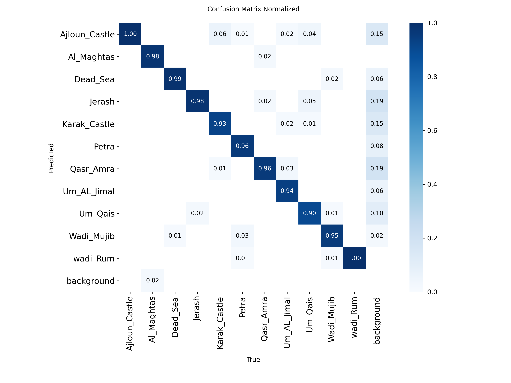

# Rawi AI

AI-powered digital storyteller for exploring Jordanian landmarks.

## Project Overview

Rawi AI is an AI-powered tourism project designed to help users discover and explore Jordanian landmarks through:

* Image recognition
* AI-generated tourism stories
* Multilingual support
* Retrieval-Augmented Generation (RAG)
* Conversational query rewriting
* Text-to-speech (TTS)
* Landmark facts and visitor information
* Interactive maps and tourism information

The system identifies a Jordanian landmark from an input image and provides an interactive tourism experience based on the available knowledge and verified landmark facts.

## Main System Flow

```text
Input Image
     ↓
YOLO11m Landmark Detection
     ↓
Detected Jordanian Landmark
     ↓
┌───────────────────────────────┐
│                               │
│  Story Generation             │
│  Hybrid Story Cache           │
│                               │
│  Rawi Chat                    │
│  Query Rewriting → RAG → LLM  │
│                               │
└───────────────────────────────┘
     ↓
Story / Answer / TTS / Facts / Map
```

aset Split

| Split      |     Images | Object Instances |
| ---------- | ---------: | ---------------: |
| Train      |     10,787 |           31,253 |
| Validation |        739 |              770 |
| Test       |        471 |              482 |
| **Total**  | **11,997** |       **32,505** |

The dataset contains 11 landmark classes:

* Ajloun Castle
* Al-Maghtas
* Dead Sea
* Jerash
* Karak Castle
* Petra
* Qasr Amra
* Umm Al-Jimal
* Umm Qais
* Wadi Mujib
* Wadi Rum

### Preprocessing

The dataset was preprocessed using Roboflow.

* **Auto-Orient:** Applied
* **Resize:** Stretch to 512×512
* **Grayscale:** Applied

### Augmentations

* **Outputs per training example:** 3
* **90° Rotate:** Clockwise, Counter-Clockwise
* **Crop:** 0% Minimum Zoom, 20% Maximum Zoom
* **Hue:** Between -15° and +15°
* **Exposure:** Between -10% and +10%
* **Blur:** Up to 2.5px
* **Noise:** Up to 0.1% of pixels
* **Mosaic:** Applied

### Bounding Box Augmentations

* **90° Rotate:** Clockwise, Counter-Clockwise
* **Exposure:** Between -10% and +10%
* **Blur:** Up to 2.5px
* **Noise:** Up to 0.1% of pixels

## AI Components

### Object Detection

Rawi uses a YOLO11m object detection model to identify Jordanian landmarks from input images.

The trained m### Dataset

The Rawi AI object detection dataset contains **11,997 images** across **11 Jordanian landmarks**.

[📂 Access the Dataset](https://drive.google.com/drive/folders/1wJkB3o_Oi7vyjOb9TwWgVUlEW7WsPMEd?usp=sharing)


## Model Evaluation

The final YOLO11m model was evaluated on a validation set of 941 images containing 941 object instances.

| Metric    | Score |
| --------- | ----: |
| Precision | 97.9% |
| Recall    | 96.1% |
| mAP@50    | 98.7% |
| mAP@50-95 | 98.5% |

### Per-Class mAP@50

| Landmark      | mAP@50 |
| ------------- | -----: |
| Ajloun Castle |  98.4% |
| Al-Maghtas    |  99.4% |
| Dead Sea      |  99.5% |
| Jerash        |  99.5% |
| Karak Castle  |  98.1% |
| Petra         |  99.5% |
| Qasr Amra     |  99.3% |
| Umm Al-Jimal  |  99.3% |
| Umm Qais      |  95.7% |
| Wadi Mujib    |  97.9% |
| Wadi Rum      |  99.4% |

### Confusion Matrix

The normalized confusion matrix shows the detection behavior across the 11 landmark classes and highlights the main confusion patterns and missed detections.




### Story Generation

Rawi generates tourism stories based on verified landmark facts.

Stories are available in:

* Arabic
* English
* French

Three story lengths are supported:

* Short: 70–80 words
* Medium: 110–130 words
* Long: 160–190 words

The story generation prompt is stored in:

```text
prompts/generate_story_facts.md
```

### Hybrid Story Cache

To reduce repeated LLM usage and improve reliability during demonstrations and exhibitions, Rawi uses a hybrid story caching system.

The system follows this flow:

```text
Story Request
     ↓
Check Story Cache
     ↓
Story Found?
   ↙       ↘
 Yes        No
 ↓          ↓
Return     Generate
Cached     with LLM
Story        ↓
             Save to Cache
                ↓
             Return Story
```

All combinations of the supported landmarks, languages, and story lengths can be pre-generated and stored in:

```text
stories_cache.json
```

The current cache contains:

```text
11 landmarks × 3 languages × 3 lengths = 99 stories
```

The pre-generated stories use:

```text
openai/gpt-oss-120b
```

If a requested story is not available in the cache, Rawi can dynamically generate it and save the result for future requests.

### RAG Question Answering

Rawi Chat uses a Retrieval-Augmented Generation (RAG) system to answer questions about the detected landmark.

The pipeline is:

```text
User Question
     ↓
Query Rewriting
     ↓
FAISS Retrieval
     ↓
Relevant Landmark Context
     ↓
Answer Generation
     ↓
Final Answer
```

The RAG knowledge base is stored in the `rag_data/` directory using pre-built FAISS indexes and corresponding chunk files.

The system uses multilingual embeddings to retrieve relevant information for the user's question.

### Query Rewriting

Rawi can rewrite conversational questions into standalone questions before retrieving information.

For example:

```text
"When was it built?"
```

can be rewritten into a complete question referring to the currently detected landmark.

The query rewriting prompt is stored in:

```text
prompts/query_rewriting.md
```

### Answer Generation

After retrieving the relevant information, Rawi generates the final answer using the retrieved context.

The answer generation prompt is stored in:

```text
prompts/answer_generation.md
```

The answer generation system is designed to rely on the retrieved knowledge rather than introducing unsupported information.

The current chat model is:

```text
openai/gpt-oss-20b
```

### Text-to-Speech

Generated stories and responses can be converted into speech using the project's TTS component.

TTS supports the multilingual tourism experience provided by Rawi.

## Landmark Facts

Rawi maintains structured landmark information separately from the RAG knowledge base.

The facts include information such as:

* Landmark names
* Arabic, English, and French names
* Welcome messages
* Story facts
* Location
* Governorate
* Construction or establishment information
* UNESCO information
* Best visiting time
* Recommended visit time
* Historical eras
* Fun facts

These facts are used by the application for landmark information and story generation.

## Prompt Files

The main prompts are organized separately under:

```text
prompts/

├── generate_story_facts.md
├── query_rewriting.md
└── answer_generation.md
```

## Project Structure

```text
Rawi/
│
├── app.py
├── home_page.py
├── result_page.py
├── chat_page.py
├── model_rawi.py
├── rag.py
├── info_labels.py
│
├── facts.json
├── stories_cache.json
├── generate_all_stories.py
│
├── prompts/
│   ├── generate_story_facts.md
│   ├── query_rewriting.md
│   └── answer_generation.md
│
├── rag_data/
│   ├── *.index
│   └── *.pkl
│
└── best.pt
```

## Story Pre-generation

The project includes a script for generating the complete story cache:

```text
generate_all_stories.py
```

The script checks the existing cache before generating a story. This allows generation to resume without regenerating stories that already exist.

This is useful for handling API limits and avoiding unnecessary LLM usage.

## AI Models

### Object Detection

```text
YOLO11m
```

Used for detecting the 11 supported Jordanian landmarks.

### Story Generation

```text
openai/gpt-oss-120b
```

Used for generating and pre-generating tourism stories.

### RAG Chat

```text
openai/gpt-oss-20b
```

Used for query rewriting and dynamic answer generation in Rawi Chat.

### Embeddings

```text
intfloat/multilingual-e5-base
```

Used for multilingual semantic retrieval in the RAG system.

## Multilingual Support

Rawi supports three languages:

* Arabic
* English
* French

The selected language affects the generated stories, landmark information, and conversational interaction.

## Project Status

Rawi AI is an actively developed project for 2026.

The current version includes:

* YOLO11m landmark detection
* 11 Jordanian landmark classes
* Multilingual tourism stories
* 99 pre-generated story combinations
* Hybrid story caching
* Dynamic story generation fallback
* RAG-based question answering
* Conversational query rewriting
* Multilingual embeddings
* Text-to-speech
* Landmark facts and visitor information
* Interactive tourism experience

### Future Improvements

Potential future improvements include:

* Pre-generating and caching TTS audio for the 99 stories
* Further RAG retrieval tuning
* Additional Jordanian landmarks
* Further UI and interaction improvements
* Deployment and production optimization
